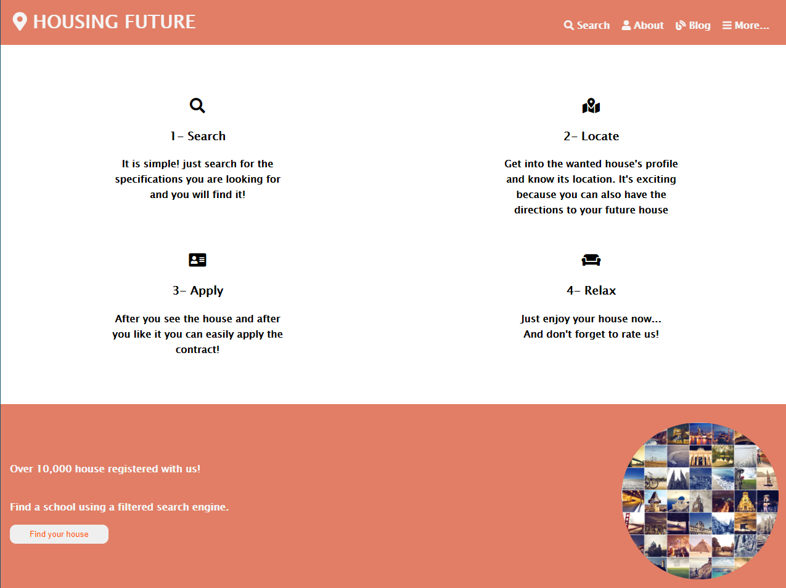

# Capstone Project 1

> Capstone project .. Finishing the first module.

Additional description about the project and its features.

## Built With

- HTML
- CSS

Built with CSS responsive techniques as "Flex, Grid, MediaQueries".

## Usage

git clone https://github.com/Mohamed-js/Capstone-Project-1.git

cd News-week

open index.html

## Live Demo

[Live Demo Link](https://mohamed-js.github.io/Capstone-Project-1/)

## Authors

👤 **Mohammed Atef**

- GitHub: [Mohammed Atef](https://github.com/Mohamed-js)
- Twitter: [@MohammedAtef](https://twitter.com/Demovejetta)
- LinkedIn: [LinkedIn](https://www.linkedin.com/in/mohamed-atef-032b6b1b0/)

## 🤝 Contributing

Contributions, issues, and feature requests are welcome!

## Show your support

Give a ⭐️ if you like this project!

## Acknowledgments

Thanks for the both parties involved in the development of this project.

## 📝 License

This project is [MIT](https://github.com/Mohamed-js/Capstone-Project-1/blob/dev-branch/LICENSE) licensed.
