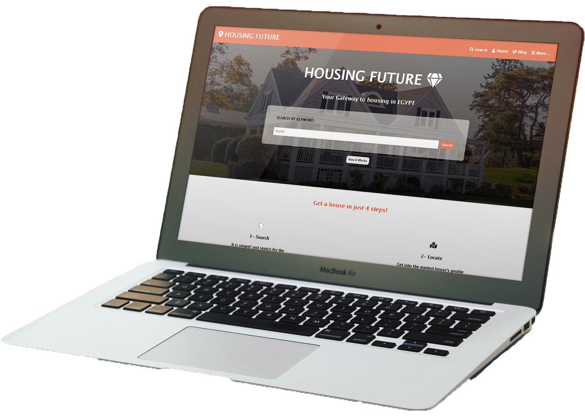

# Capstone Project 1

> Capstone project - Finishing the first module.
This project is a simulation of schools' directory but with another content(a housing one).
I have used industry tools in building this site that is composed of 3 different pages, the main page, the search results page, and the property information page. It is fully responsive to all devices that's why I used flex and grid.

Additional description about the project and its features.

## Built With

- HTML
- CSS
- Bootstrap
- Fontawesome Icons

Built with CSS responsive techniques as "Flex, Grid, and Media queries."

## Usage

1- Open your terminal.

2- Paste "git clone https://github.com/Mohamed-js/Capstone-Project-1.git" in the terminal.

3- cd CAPSTONE-PROJECT-1

4- Open index.html

5- Congratulations, you are here now!

## Live Demo

[Live Demo Link](https://mohamed-js.github.io/Capstone-Project-1/)

## Authors

👤 **Mohammed Atef**

- GitHub: [Mohammed Atef](https://github.com/Mohamed-js)
- Twitter: [@MohammedAtef](https://twitter.com/Demovejetta)
- LinkedIn: [LinkedIn](https://www.linkedin.com/in/mohamed-atef-032b6b1b0/)

## 🤝 Contributing

Contributions, issues, and feature requests are welcome!

## Show your support

Give a ⭐️ if you like this project!

## Acknowledgments

Thanks to both parties involved in the development of this project.

Design author credits:  Mathew Njuguna | PatashuleKE | Behance designer.

## 📝 License

This project is [MIT](https://github.com/Mohamed-js/Capstone-Project-1/blob/dev-area/LICENSE.md) licensed.
